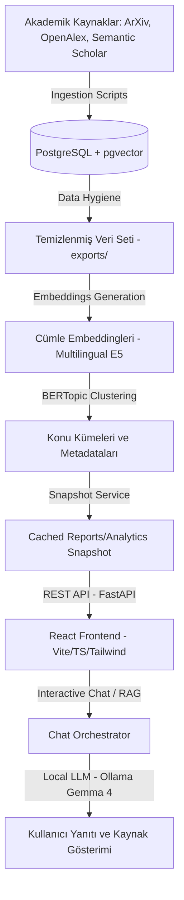

# Akademik Yayın İstihbarat ve Analiz Platformu (YTU-CE-Bitirme-Calismasi)

Bu proje, akademik literatürü otomatik olarak toplamak, temizlemek, yapay zekâ yöntemleriyle gruplamak (clustering), trend analizleri çıkarmak ve RAG (Retrieval-Augmented Generation) destekli akıllı bir soru-cevap asistanı aracılığıyla araştırmacılara sunmak amacıyla geliştirilmiş uçtan uca bir akademik araştırma ve analiz platformudur.

---

## 1. Projenin Amacı ve Çözdüğü Sorunlar

Akademik dünyada her gün binlerce yeni makale yayınlanmaktadır. Araştırmacıların kendi ilgi alanlarındaki literatürü güncel olarak takip etmesi, trendleri yakalaması ve binlerce makale arasından aradığı spesifik bilgilere ulaşması ciddi bir zaman maliyetidir. 

Bu platform:
* **Dağınık Kaynakları Bir Araya Getirir:** ArXiv, OpenAlex ve Semantic Scholar gibi farklı servislerdeki yayınları filtreleyerek tek bir veritabanında toplar.
* **Akıllı Gruplama (Topic Clustering) Yapar:** Gelişmiş dil modelleri ve BERTopic algoritması kullanarak makaleleri soyut metinleri (abstract) üzerinden otomatik olarak tematik kümelere (topic) ayırır.
* **Haftalık Özet ve Trend Raporları Üretir:** Küme bazlı literatür özetleri oluşturarak en çok atıf alan veya öne çıkan çalışmaları belirler.
* **RAG Tabanlı Soru-Cevap Desteği Sağlar:** Kullanıcıların sistemdeki makaleler hakkında sorular sormasına izin verir. LLM, veritabanındaki makalelerin metinlerini kaynak göstererek (`[S1]`, `[S2]`) yanıtlar hazırlar ve halüsinasyon riskini en aza indirir.

---

## 2. Temel Mimari ve Teknik Altyapı

Platform, modern ve performanslı teknolojiler üzerine inşa edilmiştir:



### Teknoloji Yığını (Tech Stack)
* **Frontend:** React, Vite, TypeScript, Tailwind CSS, Recharts (Grafikler).
* **Backend:** FastAPI (Python), Uvicorn.
* **Veritabanı & Vektör Arama:** PostgreSQL + `pgvector` eklentisi.
* **Yapay Zekâ & NLP:**
  * **Cümle Embeddingleri:** `sentence-transformers` kütüphanesi ve `intfloat/multilingual-e5-base` modeli.
  * **Gruplama:** BERTopic (UMAP boyut indirgeme + HDBSCAN kümeleme + c-TF-IDF kelime çıkarma).
  * **Dil Modeli:** Yerel Ollama sunucusu üzerinde çalışan `gemma4:e4b` (veya uyumlu alternatif modeller).
* **Veri Tabanı Göçleri (Database Migrations):** Alembic.
* **Konteynerleştirme:** Docker & Docker Compose.

---

## 3. Temel Pipeline Adımları (AI Engine)

Sistemdeki veri akışı aşamalı bir boru hattı (pipeline) yapısıyla çalışmaktadır:

1. **Veri Toplama (Ingestion):** 
   * [run_bulk_ingest.py](file:///Users/eymendogru/Desktop/academic-platform/YTU-CE-Bitirme-Calismasi/run_bulk_ingest.py) ve [run_kaggle_arxiv_ingest.py](file:///Users/eymendogru/Desktop/academic-platform/YTU-CE-Bitirme-Calismasi/run_kaggle_arxiv_ingest.py) scriptleri ile arXiv (özellikle Computer Science `cs.*` kategorisi), OpenAlex ve Semantic Scholar servislerinden yayınlar çekilir.
   * API hız limitlerine (rate limit) uygun olarak kuyruklama ve kaldığı yerden devam edebilme (state checkpoint) özellikleri barındırır.
2. **Veri Hijyeni ve Hazırlığı (Data Hygiene):** 
   * [export_clean_papers.py](file:///Users/eymendogru/Desktop/academic-platform/YTU-CE-Bitirme-Calismasi/ai_engine/data_hygiene/export_clean_papers.py) scripti ile boş veya çok kısa başlık/özet içeren hatalı kayıtlar temizlenir, dublike yayınlar elenir, dil tespiti yapılır ve derleme (survey/review) makaleleri etiketlenir.
3. **Embedding Üretimi:** 
   * [embeddings_to_db.py](file:///Users/eymendogru/Desktop/academic-platform/YTU-CE-Bitirme-Calismasi/ai_engine/embeddings/embeddings_to_db.py) scripti ile makale başlığı, özeti ve temel metadataları birleştirilerek vektör temsilcileri üretilir. Hash tabanlı kontrol mekanizması sayesinde metni değişmeyen veya daha önce embedding'i oluşturulmuş makaleler tekrar hesaplanmaz, sistem kaynakları korunur.
4. **Gruplama ve Konu Çıkarımı (Clustering & BERTopic):** 
   * [ClusterFunctions.py](file:///Users/eymendogru/Desktop/academic-platform/YTU-CE-Bitirme-Calismasi/ai_engine/clustering/ClusterFunctions.py) scripti ile makaleler anlamsal olarak gruplanır.
   * Her küme için en belirgin anahtar kelimeler ve temsilci makaleler (representative papers) seçilir.
   * Güven skoru yüksek olan dışta kalan makaleler (outliers) en yakın küme merkezine (centroid) cosine benzerliği ile otomatik atanır.

---

## 4. Akıllı RAG Soru-Cevap Akışı (Retrieval-Augmented Generation)

Chat modülü sıradan bir sohbet robotunun ötesinde, dinamik yönlendirme ve veritabanı filtreleme yeteneğine sahiptir:

1. **İstek Yönlendirme (Routing & Query Rewriting):** 
   * Kullanıcı sorusu geldiğinde, [rag_router_service.py](file:///Users/eymendogru/Desktop/academic-platform/YTU-CE-Bitirme-Calismasi/backend/app/services/rag_router_service.py) aracılığıyla dil modeline bir yönlendirme çağrısı yapılır.
   * LLM, sorunun yerel veritabanında arama gerektirip gerektirmediğine karar verir.
   * Arama gerekiyorsa, sorguyu optimize ederek yeniden yazar (`rewritten_query`) ve sorudan tarih, kaynak, kategori (örneğin: `cs.AI`), atıf sayısı, DOI ve PDF linki gibi filtreleri çıkarır.
2. **Vektör ve Metaveri Filtreleme (Retrieval):** 
   * [retrieval_service.py](file:///Users/eymendogru/Desktop/academic-platform/YTU-CE-Bitirme-Calismasi/backend/app/services/retrieval_service.py) üzerinden, çıkarılan filtreler SQL düzeyinde uygulanarak veritabanındaki `pgvector` sütununda semantik arama gerçekleştirilir.
   * Tarihsel güncellik ve atıf sayısı gibi faktörlere göre Python tarafında hafif bir yeniden sıralama (re-ranking) yapılır.
3. **Bellek Yönetimi (Conversation Memory):** 
   * [conversation_memory_service.py](file:///Users/eymendogru/Desktop/academic-platform/YTU-CE-Bitirme-Calismasi/backend/app/services/conversation_memory_service.py) ile oturum bazlı geçmiş yönetilir.
   * "Önceki cevaptaki ikinci makaleyi özetle" veya "bunlardan PDF'i olanları listele" gibi takip sorularında, geçmişte cited edilmiş makaleler ve filtreler hafızada tutulur.
4. **Orkestrasyon ve Cevap Üretimi (Chat Orchestration):** 
   * [chat_orchestrator.py](file:///Users/eymendogru/Desktop/academic-platform/YTU-CE-Bitirme-Calismasi/backend/app/services/chat_orchestrator.py) tüm akışı yöneterek dil modeline bağlamı, geçmişi ve arama sonuçlarını iletir.
   * Yanıt içinde kaynaklar `[S1]`, `[S2]` şeklinde kesin olarak belirtilir ve mesajın altına tıklanabilir makale bağlantıları eklenir.

---

## 5. Proje Dizin Yapısı

Proje dosyaları mantıksal olarak katmanlara ayrılmıştır:

```text
├── ai_engine/                         # Yapay Zekâ ve Veri İşleme Hattı (AI Pipeline)
│   ├── clustering/                    # BERTopic gruplama kodları ve deney araçları
│   │   └── ClusterFunctions.py        # Kümeleme çalıştıran ana script
│   ├── data_hygiene/                  # Veri temizleme ve hazırlık katmanı
│   │   └── export_clean_papers.py     # Veri temizleme scripti
│   ├── embeddings/                    # Cümle embedding üretimi
│   │   ├── embeddings_to_db.py        # Vektörleri DB'ye yazan script
│   │   └── model.py                   # Embedding model wrapper'ı
│   └── ingestion/                     # API veri çekiciler (Extractors)
│       ├── extractors/                # arXiv, OpenAlex, Semantic Scholar entegrasyonları
│       └── loader.py                  # Çekilen veriyi DB şemasına dönüştürüp yazan yükleyici
├── backend/                           # FastAPI Sunucusu
│   └── app/
│       ├── api/                       # API Endpoint Tanımları (Chat, Analytics, Bulletin, Auth)
│       ├── core/                      # Uygulama Konfigürasyonu (.env okuma)
│       ├── models/                    # SQLAlchemy modelleri (Veritabanı tabloları)
│       ├── schemas/                   # Pydantic şemaları (Veri doğrulama)
│       ├── services/                  # İş Mantığı Katmanı (Orchestrator, RAG, Memory, Snapshot)
│       └── worker/                    # Arka plan işleri (Celery & Redis kurulumları)
├── database/                          # Veritabanı Şeması ve Göçleri
│   ├── alembic/                       # Veritabanı şema göç versiyonları
│   ├── alembic.ini                    # Alembic ayarları
│   └── db.py                          # PostgreSQL bağlantı yöneticisi
├── docs/                              # Sistem Dokümantasyonları
├── evaluation/                        # RAG ve Kümeleme metrik değerlendirme araçları
├── exports/                           # Pipeline çıktılarının (raporlar, temiz CSV'ler) tutulduğu dizin
├── frontend/                          # Vite + React + TypeScript Arayüzü
│   ├── src/
│   │   ├── components/                # Layout, Sidebar, AuthGuard vb. ortak bileşenler
│   │   ├── pages/                     # Dashboard, Chat, Bulletin, Auth sayfaları
│   │   └── lib/                       # API bağlantı ve tip tanımlamaları
│   └── package.json
├── tests/                             # Unit ve Integration Testleri
│   ├── test_ai_pipeline.py            # AI pipeline testi
│   ├── test_rag_router.py             # RAG yönlendirici testi
│   ├── test_retrieval_service.py      # Vektör arama testi
│   └── test_conversation_memory.py    # Sohbet hafıza testi
├── docker-compose.yml                 # Docker orkestrasyon dosyası
├── requirements.txt                   # Genel Python bağımlılıkları
└── reset_database.py                  # Veritabanı sıfırlama aracı
```

---

## 6. Veri Modeli İlişkileri (Database Schema)

Sistem ilişkisel ve vektörel veriyi PostgreSQL üzerinde şu temel modellerle yönetir:

* **[ArticleData.py](file:///Users/eymendogru/Desktop/academic-platform/YTU-CE-Bitirme-Calismasi/database/models/ArticleData.py) (`articles`):** Makale metadataları (başlık, özet, yazar, doi, kaynak) ve vektör embedding'i (`embedding` - pgvector).
* **[ClusterData.py](file:///Users/eymendogru/Desktop/academic-platform/YTU-CE-Bitirme-Calismasi/database/models/ClusterData.py) (`clusters`):** Küme bilgileri (küme numarası, atanan anahtar kelimeler, temsilci makale ID'leri, kaynak dağılımları).
* **[ClusterDigest.py](file:///Users/eymendogru/Desktop/academic-platform/YTU-CE-Bitirme-Calismasi/database/models/ClusterDigest.py) (`cluster_digests`):** LLM tarafından üretilen küme özetleri ve öne çıkan başlıklar (cache yapısı).
* **[ChatSession.py](file:///Users/eymendogru/Desktop/academic-platform/YTU-CE-Bitirme-Calismasi/database/models/ChatSession.py) (`chat_sessions`):** Kullanıcı sohbet oturumları, oturum başlıkları ve LLM tarafından güncellenen sohbet özetleri (session summaries).
* **[ChatMessage.py](file:///Users/eymendogru/Desktop/academic-platform/YTU-CE-Bitirme-Calismasi/database/models/ChatMessage.py) (`chat_messages`):** Sohbet mesajları, rolü (user/assistant) ve asistan mesajları için yönlendirme kararlarını, cited edilen kaynak ID'lerini saklayan `metadata_json`.
* **[ReportSnapshot.py](file:///Users/eymendogru/Desktop/academic-platform/YTU-CE-Bitirme-Calismasi/database/models/ReportSnapshot.py) (`report_snapshots`):** Performans optimizasyonu amacıyla önceden hesaplanmış dashboard istatistiklerini ve bulletin yayınlarını önbellekte (cache) tutar.

---

## 7. Geliştirici Çalıştırma Akışı (Runbook Quickstart)

Yerel geliştirme ortamında sistemi ayağa kaldırmak için genel adımlar şunlardır:

1. **Docker Compose Başlatma (PostgreSQL ve Frontend/Backend):**
   ```bash
   docker compose up --build
   ```
2. **Veritabanı Şemasını Güncelleme (Alembic Migration):**
   ```bash
   .venv/bin/alembic -c database/alembic.ini upgrade head
   ```
3. **Ollama Sunucusunda Modeli Hazırlama:**
   ```bash
   ollama pull gemma4:e4b
   ```
4. **Veri Çekme, Embedding ve Kümeleme Adımları:**
   ```bash
   # 100 makale çek
   .venv/bin/python run_bulk_ingest.py --max-results 100 --sources arxiv --query "retrieval augmented generation"
   
   # Embedding üret
   .venv/bin/python ai_engine/embeddings/embeddings_to_db.py --total-articles 100 --batch-size 50
   
   # BERTopic ile kümele
   .venv/bin/python ai_engine/clustering/ClusterFunctions.py --max-articles 100
   
   # Rapor ve snapshotları oluştur
   .venv/bin/python -c "from database.db import SessionLocal; from backend.app.services.report_snapshot_service import ReportSnapshotService; db=SessionLocal(); print(ReportSnapshotService(db).refresh_default_snapshots()); db.close()"
   ```
5. **Testleri Çalıştırma:**
   ```bash
   .venv/bin/pytest tests
   ```

---

## 8. Nesnel (Unsupervised/Internal) Değerlendirme Metrikleri

BERTopic etiketlenmemiş veriyle çalıştığı için elimizde bir "ground truth" (kesin doğru etiketler) bulunmamaktadır. Bu nedenle kümeleme (clustering) kalitesi matematiksel metriklerle ölçülmektedir:

### 1. Topic Coherence (Metin Tutarlılığı - $c_v$ veya $u_{mass}$)
* **Nedir:** Kümeye atanan en baskın kelimelerin (c-TF-IDF çıktılarının) makale özetlerinde bir arada geçme sıklığını ölçer. Skor 1'e ne kadar yakınsa, o küme o kadar anlamlıdır.
* **Kullanımı:** Konuların anlamsal bütünlüğünü ve insanlar tarafından anlaşılabilirliğini (human interpretability) doğrulamak için kritik bir metriktir.

### 2. Silhouette Score ve Davies-Bouldin Index
* **Silhouette Score:** Makalelerin kendi küme merkezlerine yakınlığını ve diğer küme merkezlerinden uzaklığını ölçer. Cosine distance/similarity baz alınarak hesaplanır.
* **Davies-Bouldin Index:** Kümelerin kendi içindeki sıkışıklığı (tightness) ve kümeler arası ayrışımı (separation) oranlar. Düşük değerler daha iyi kümelenmeye işaret eder.

> [!NOTE]
> **Skeptik Soru:** Silhouette skorunu Multilingual E5 embedding'leri üzerinden mi hesaplamalıyız, yoksa UMAP ile indirgenmiş uzayda mı?
> 
> **Cevap:** Platformumuzda Silhouette skoru **orijinal yüksek boyutlu embedding uzayında (768-boyutlu E5 uzayı)** hesaplanmaktadır. UMAP doğrusal olmayan (non-linear) bir bükme yaptığı için indirgenmiş uzaydaki mesafeler gerçek anlamsal mesafeleri yanıltabilir. Orijinal uzayda hesaplama yapmak çok daha gerçekçi ve güvenilir sonuçlar üretir.

---

Bu mimari sayesinde platform, yüksek arama doğruluğu (RAG yönlendirmesi ve SQL filtreleme), hızlı arayüz yüklenmesi (cached snapshots) ve otomatik akademik konu takibi sunarak araştırmacılar için verimli bir istihbarat aracı haline gelmektedir.
