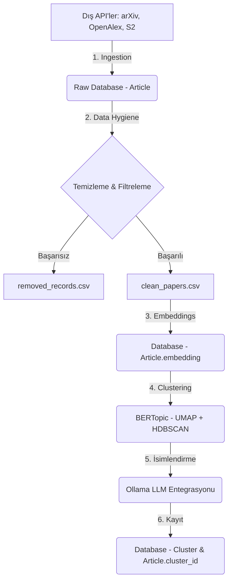

# AI Engine (Yapay Zeka Motoru) Modülü Dokümantasyonu

`ai_engine` modülü, platformdaki akademik yayınların dış kaynaklardan çekilmesi (ingestion), temizlenmesi (data hygiene), vektörleştirilmesi (embeddings) ve tematik olarak gruplandırılması (clustering) süreçlerini yöneten uçtan uca bir veri işleme boru hattıdır (pipeline).

Modül altındaki ana klasörlerin ve dosyaların sorumlulukları aşağıda detaylıca açıklanmıştır:

---

## 1. [ingestion](file:///Users/eymendogru/Desktop/academic-platform/YTU-CE-Bitirme-Calismasi/ai_engine/ingestion) (Veri Çekme ve Yükleme)
Dış API'lerden (arXiv, OpenAlex, Semantic Scholar) makaleleri çekmek, standartlaştırmak ve veritabanına kaydetmekten sorumludur.

- **[extractors/](file:///Users/eymendogru/Desktop/academic-platform/YTU-CE-Bitirme-Calismasi/ai_engine/ingestion/extractors)**:
  - **[base.py](file:///Users/eymendogru/Desktop/academic-platform/YTU-CE-Bitirme-Calismasi/ai_engine/ingestion/extractors/base.py)**: Tüm veri çekiciler için ortak arayüzü (`BaseExtractor` soyut sınıfı) tanımlar. `fetch_articles` (arama sorgusu ile çekme) ve `fetch_article_by_id` (ID ile tek makale çekme) metotlarını barındırır.
  - **[arxiv_extractor.py](file:///Users/eymendogru/Desktop/academic-platform/YTU-CE-Bitirme-Calismasi/ai_engine/ingestion/extractors/arxiv_extractor.py)**: arXiv API'sini kullanarak akademik yayınları çeken sınıftır.
  - **[openalex_extractor.py](file:///Users/eymendogru/Desktop/academic-platform/YTU-CE-Bitirme-Calismasi/ai_engine/ingestion/extractors/openalex_extractor.py)**: OpenAlex API entegrasyonudur.
  - **[s2_extractor.py](file:///Users/eymendogru/Desktop/academic-platform/YTU-CE-Bitirme-Calismasi/ai_engine/ingestion/extractors/s2_extractor.py)**: Semantic Scholar API entegrasyonudur.
- **[schemas.py](file:///Users/eymendogru/Desktop/academic-platform/YTU-CE-Bitirme-Calismasi/ai_engine/ingestion/schemas.py)**: Dış API'lerden gelen farklı veri yapılarını tek bir potada eriten `RawArticleSchema` (Pydantic modeli) şemasını tanımlar. Bu şema veritabanındaki `Article` modeli ile birebir eşleşir.
- **[loader.py](file:///Users/eymendogru/Desktop/academic-platform/YTU-CE-Bitirme-Calismasi/ai_engine/ingestion/loader.py)**: Çekilen ham veriyi doğrulayarak veritabanına (PostgreSQL) kaydeder.
  - Sadece Bilgisayar Bilimleri (Computer Science) alanındaki makaleleri filtreler (`_is_computer_science_article`).
  - Metin boyutlarını veritabanı kolon sınırlarına uygun şekilde kırpar ve string temizliği yapar.
  - Veri tabanında `external_id` üzerinde çakışma (conflict) durumunda PostgreSQL `UPSERT` mekanizmasını kullanarak mevcut verileri günceller. Verileri 1000'erli paketler halinde kaydeder.
- **[state_manager.py](file:///Users/eymendogru/Desktop/academic-platform/YTU-CE-Bitirme-Calismasi/ai_engine/ingestion/state_manager.py)**: Veri çekme işleminin durumunu (`ingestion_state.json` dosyasında) saklar. Böylece pipeline durduğunda veya yeniden çalıştırıldığında nerede kalındığı takip edilebilir.

---

## 2. [data_hygiene](file:///Users/eymendogru/Desktop/academic-platform/YTU-CE-Bitirme-Calismasi/ai_engine/data_hygiene) (Veri Temizliği ve Hazırlığı)
Veritabanına eklenen makaleleri analiz edilebilir ve vektörleştirilebilir hale getirmek için ileri düzey temizleme, çoklama önleme (deduplication) ve kalite kontrol işlemlerini yürütür.

- **[text_preparation.py](file:///Users/eymendogru/Desktop/academic-platform/YTU-CE-Bitirme-Calismasi/ai_engine/data_hygiene/text_preparation.py)**: Metin temizleme mantığını barındırır:
  - Başlıkları küçük harfe çevirip noktalama ve gereksiz boşluklardan arındırarak tekilleştirme için normalize eder (`normalize_title_for_dedup`).
  - Metinlerdeki HTML karakterlerini, LaTeX ifadelerini (`$`, `\`, `{}` vb.) temizler.
  - Akademik basmakalıp sözleri ("in this paper", "we propose", "experimental results" vb.) kaldırarak konuyu daha iyi temsil eden arındırılmış metinler üretir (`remove_academic_boilerplate`).
  - `langdetect` kütüphanesini kullanarak yalnızca İngilizce makaleleri filtreler.
  - Başlığa göre makalelerin bir "Survey/Review" (Derleme) yazısı olup olmadığını sınıflandırır.
  - Embedding ve BERTopic için özel girdi metinleri (`embedding_text` ve `representation_text`) oluşturur.
- **[export_clean_papers.py](file:///Users/eymendogru/Desktop/academic-platform/YTU-CE-Bitirme-Calismasi/ai_engine/data_hygiene/export_clean_papers.py)**: Veritabanındaki makaleleri okuyarak `text_preparation.py` filtresinden geçirir ve temizlenmiş verileri dışa aktarır (`clean_papers.csv`, `removed_records.csv`, `duplicate_records.csv`). Ayrıca kalite metriklerini içeren `data_hygiene_report.md` raporunu oluşturur.

---

## 3. [embeddings](file:///Users/eymendogru/Desktop/academic-platform/YTU-CE-Bitirme-Calismasi/ai_engine/embeddings) (Vektörleştirme)
Makalelerin anlamsal (semantic) analizini yapabilmek adına metinleri sayısal vektörlere dönüştürür.

- **[model.py](file:///Users/eymendogru/Desktop/academic-platform/YTU-CE-Bitirme-Calismasi/ai_engine/embeddings/model.py)**: `EmbeddingModel` isminde bir singleton sınıf barındırır. Arka plandaki `EmbeddingService` aracılığıyla doküman ve sorgu metinlerinin embedding'lerini üretir ve kosinüs benzerliği hesaplar.
- **[embeddings_to_db.py](file:///Users/eymendogru/Desktop/academic-platform/YTU-CE-Bitirme-Calismasi/ai_engine/embeddings/embeddings_to_db.py)**: Temizlenmiş CSV dosyalarından veya doğrudan veritabanından makaleleri okuyarak toplu halde embedding'leri hesaplar ve veritabanına kaydeder.
  - **Optimizasyon**: `embedding_text_hash` kullanarak, metni veya modeli değişmemiş makalelerin embedding'lerini tekrar hesaplamadan hızlıca atlar (caching/skip logic).

---

## 4. [clustering](file:///Users/eymendogru/Desktop/academic-platform/YTU-CE-Bitirme-Calismasi/ai_engine/clustering) (Kümeleme ve Konu Modelleme)
Benzer makaleleri bir araya getirerek tematik akademik araştırma konularını (küme/cluster) belirler.

- **[ClusterFunctions.py](file:///Users/eymendogru/Desktop/academic-platform/YTU-CE-Bitirme-Calismasi/ai_engine/clustering/ClusterFunctions.py)**: BERTopic kütüphanesini kullanarak kümeleme süreçlerini yönetir:
  - **Donanım Profilleri**: Sunucunun belleğine ve işlemcisine göre (örn. Apple Silicon M4 Pro veya Memory Saver gibi) özel thread ve hafıza sınırları belirler.
  - **Uzaklık Azaltma ve Kümeleme**: Makale embedding'lerini UMAP ile boyut indirgemeye tabi tutar ve HDBSCAN algoritması ile kümeleri bulur.
  - **Temsilcilik (c-TF-IDF)**: Her kümenin en karakteristik kelimelerini belirlemek için sınıf tabanlı TF-IDF (c-TF-IDF) uygular.
  - **Outlier (Aykırı Değer) Yönetimi**: Kümelere atanamamış makaleleri, güven eşiklerine göre en yakın küme merkezine (centroid) dahil eder.
  - **LLM ile İsimlendirme**: Belirlenen kümelerin anahtar kelimelerini yerel bir dil modeline (Ollama) göndererek o küme için akademik ve anlamlı bir konu başlığı/açıklaması üretir (`_generate_cluster_name`).
  - **Veritabanı Entegrasyonu**: Oluşturulan kümeleri `Cluster` tablosuna yazar, makaleleri de ilgili `cluster_id` ile günceller.
  - Son adımda arka plandaki istatistiksel raporları (`ReportSnapshotService`) günceller.

---

## Veri Akışı ve Pipeline Düzeni

Aşağıdaki şema, verinin sistemde nasıl işlendiğini göstermektedir:

Bu modüller bir araya gelerek platformun akademik literatürü otomatik olarak takip etmesini, temizlemesini, kategorize etmesini ve raporlamasını sağlar.
