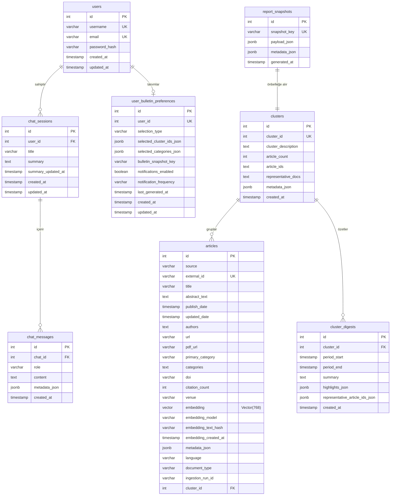

# Veritabanı Şeması ve Veri Yapısı Dokümantasyonu (academic_platform)

Bu doküman, akademik analiz ve RAG platformunun ana veritabanı olan `academic_platform` veritabanının yapısını, tablolarını, veri tiplerini ve güncel veri dağılım istatistiklerini detaylandırmaktadır.

---

## 1. Genel Bakış ve Veri İstatistikleri

Platform veritabanı **PostgreSQL** üzerinde yapılandırılmış olup, vektör aramaları için **pgvector** eklentisini kullanmaktadır. Orijinal veritabanında gerçekleştirilen analiz sonuçlarına göre temel istatistikler şu şekildedir:

* **Toplam Makale Sayısı (`articles`):** 300,000 adet
* **Embedding'i Oluşturulmuş Makale Sayısı:** 299,638 adet (%99.88 kapsama)
* **Kategori Dağılımı (ArXiv Bilgisayar Bilimleri `cs.*` Ağırlıklı Top 10):**
  1. `cs.CV` (Computer Vision): 50,455 makale
  2. `cs.LG` (Machine Learning): 42,790 makale
  3. `cs.CL` (Computation and Language - NLP): 25,491 makale
  4. `cs.IT` (Information Theory): 13,024 makale
  5. `cs.RO` (Robotics): 12,109 makale
  6. `cs.AI` (Artificial Intelligence): 10,690 makale
  7. `cs.CR` (Cryptography and Security): 10,485 makale
  8. `math.NA` (Numerical Analysis): 7,665 makale
  9. `stat.ML` (Machine Learning - Statistics): 7,195 makale
  10. `eess.SY` (Systems and Control): 6,465 makale
* **Veri Tarih Aralığı:** `01-01-2016` ile `21-05-2026` arası (Yaklaşık 10 yıllık yayın havuzu)
* **Toplam Küme Sayısı (`clusters`):** 491 adet anlamsal konu grubu

---

## 2. İlişkisel Şema Modeli (ERD)

Aşağıdaki şemada, platformdaki tabloların anlamsal ilişkileri gösterilmiştir. Veritabanı düzeyinde katı yabancı anahtar (Foreign Key) kısıtlamaları minimumda tutularak performans artırılmış, ilişkiler uygulama katmanında (FastAPI/SQLAlchemy) yönetilmektedir.

---

## 3. Tablo Detayları ve Sütun Yapıları

### 3.1. `articles` (Makaleler)
Sistemdeki tüm akademik yayın metadatalarını ve bunların anlamsal vektörlerini (embeddings) depolar.

* **Toplam Satır Sayısı:** 300,000
* **Model Dosyası:** [ArticleData.py](file:///Users/eymendogru/Desktop/academic-platform/YTU-CE-Bitirme-Calismasi/database/models/ArticleData.py)

| Sütun Adı | Veri Tipi | Nullable | Açıklama / Kısıtlama |
| :--- | :--- | :---: | :--- |
| `id` | `integer` | `NO` | Primary Key, Auto-increment. |
| `source` | `character varying(50)` | `NO` | Kaynak veri tabanı (örn: `'arxiv'`, `'openalex'`). İndeksli. |
| `external_id` | `character varying(100)` | `NO` | Kaynağa ait benzersiz ID. Unique Index. |
| `title` | `character varying(500)` | `NO` | Makale başlığı. |
| `abstract_text` | `text` | `YES` | Makale özet metni. |
| `publish_date` | `timestamp` | `YES` | Yayınlanma tarihi. İndeksli. |
| `updated_date` | `timestamp` | `YES` | Kaynakta güncellenme tarihi. |
| `authors` | `text` | `YES` | Yazarların isimleri listesi (virgülle ayrılmış). |
| `url` | `character varying(500)` | `YES` | Makale detay sayfası web linki. |
| `pdf_url` | `character varying(500)` | `YES` | Makalenin doğrudan PDF indirme linki. |
| `primary_category` | `character varying(100)` | `YES` | Ana konu kategorisi (Örn: `'cs.CV'`). İndeksli. |
| `categories` | `text` | `YES` | İlişkili diğer alt kategoriler. |
| `doi` | `character varying(255)` | `YES` | Dijital Nesne Tanımlayıcı (DOI). İndeksli. |
| `citation_count` | `integer` | `YES` | Alınan atıf sayısı. |
| `venue` | `character varying(500)` | `YES` | Yayınlandığı konferans, dergi veya mecra. |
| `embedding` | `vector(768)` | `YES` | **pgvector** 768 boyutlu vektör sütunu (Multilingual E5 modeli çıktısı). |
| `embedding_model` | `character varying(120)` | `YES` | Vektörü üreten model adı (`'intfloat/multilingual-e5-base'`). |
| `embedding_text_hash` | `character varying(64)` | `YES` | Vektör üretilen metnin SHA-256 hash'i. İndeksli (Skip kontrolü için). |
| `embedding_created_at` | `timestamp` | `YES` | Vektörün veritabanına yazılma zamanı. |
| `metadata_json` | `jsonb` | `YES` | Kaynağa özel esnek metadatalar (Örn: OpenAlex konseptleri). |
| `language` | `character varying(20)` | `YES` | Algılanan makale dili (Örn: `'en'`). İndeksli. |
| `document_type` | `character varying(50)` | `YES` | Belge sınıfı (Örn: `'article'`, `'survey'`). İndeksli. |
| `ingestion_run_id` | `character varying(80)` | `YES` | Verinin çekildiği ingestion çalışma ID'si. İndeksli. |
| `cluster_id` | `integer` | `YES` | Ait olduğu küme numarası (`clusters.cluster_id` ile eşleşir). İndeksli. |

---

### 3.2. `clusters` (Konu Kümeleri)
BERTopic ile gruplanmış makale kümelerinin detaylarını ve anahtar kelimelerini tutar.

* **Toplam Satır Sayısı:** 491
* **Model Dosyası:** [ClusterData.py](file:///Users/eymendogru/Desktop/academic-platform/YTU-CE-Bitirme-Calismasi/database/models/ClusterData.py)

| Sütun Adı | Veri Tipi | Nullable | Açıklama |
| :--- | :--- | :---: | :--- |
| `id` | `integer` | `NO` | Primary Key, Auto-increment. |
| `cluster_id` | `integer` | `NO` | BERTopic tarafından atanan küme ID'si. Unique & Index. |
| `cluster_description` | `text` | `YES` | LLM veya en baskın kelimelerle oluşturulan küme başlığı/tanımı. |
| `article_count` | `integer` | `YES` | Kümeye atanan toplam makale sayısı. |
| `article_ids` | `text` | `YES` | Kümeye ait makale ID'lerinin listesi (virgülle ayrılmış). |
| `representative_docs` | `text` | `YES` | Kümenin en merkezindeki representative makale ID'leri. |
| `metadata_json` | `jsonb` | `YES` | Kümenin kaynak dağılımları, tarih aralıkları ve anahtar kelimeleri. |
| `created_at` | `timestamp` | `YES` | Oluşturulma tarihi. |

---

### 3.3. `cluster_digests` (Küme Özetleri)
Kümelerin LLM tarafından çıkarılmış periyodik özet raporlarını (weekly/monthly digest) önbellekler.

* **Toplam Satır Sayısı:** 3,437
* **Model Dosyası:** [ClusterDigest.py](file:///Users/eymendogru/Desktop/academic-platform/YTU-CE-Bitirme-Calismasi/database/models/ClusterDigest.py)

| Sütun Adı | Veri Tipi | Nullable | Açıklama |
| :--- | :--- | :---: | :--- |
| `id` | `integer` | `NO` | Primary Key. |
| `cluster_id` | `integer` | `NO` | İlişkili küme ID'si (`clusters.cluster_id`). İndeksli. |
| `period_start` | `timestamp` | `YES` | Özetin kapsadığı dönem başlangıç tarihi. İndeksli. |
| `period_end` | `timestamp` | `YES` | Özetin kapsadığı dönem bitiş tarihi. İndeksli. |
| `summary` | `text` | `NO` | LLM tarafından üretilen anlamsal özet metni. |
| `highlights_json` | `jsonb` | `YES` | Öne çıkan başlıklar ve bulgular (JSON Liste). |
| `representative_article_ids_json`| `jsonb` | `YES` | Özetin dayandırıldığı makalelerin ID listesi. |
| `created_at` | `timestamp` | `NO` | Raporun oluşturulma zamanı. |

---

### 3.4. `chat_sessions` & `chat_messages` (Sohbet Geçmişi)
RAG sohbet arayüzündeki kullanıcı oturumlarını ve asistanın kullandığı RAG kaynaklarını depolar.

* **Kayıt Sayısı:** 17 oturum, 36 mesaj
* **Model Dosyaları:** [ChatSession.py](file:///Users/eymendogru/Desktop/academic-platform/YTU-CE-Bitirme-Calismasi/database/models/ChatSession.py), [ChatMessage.py](file:///Users/eymendogru/Desktop/academic-platform/YTU-CE-Bitirme-Calismasi/database/models/ChatMessage.py)

#### `chat_sessions`
| Sütun Adı | Veri Tipi | Nullable | Açıklama |
| :--- | :--- | :---: | :--- |
| `id` | `integer` | `NO` | Primary Key. |
| `user_id` | `integer` | `NO` | Sahip olan kullanıcının ID'si. |
| `title` | `character varying(255)` | `YES` | Oturum başlığı (Otomatik üretilir). |
| `summary` | `text` | `YES` | Sohbetin LLM tarafından çıkarılan kısa özeti (Bellek optimizasyonu için). |
| `summary_updated_at` | `timestamp` | `YES` | Özetin en son güncellendiği tarih. |
| `created_at` | `timestamp` | `NO` | Oturum oluşturulma tarihi. |
| `updated_at` | `timestamp` | `NO` | Son sohbet aktivite tarihi. |

#### `chat_messages`
| Sütun Adı | Veri Tipi | Nullable | Açıklama |
| :--- | :--- | :---: | :--- |
| `id` | `integer` | `NO` | Primary Key. |
| `chat_id` | `integer` | `NO` | Ait olduğu oturumun ID'si (`chat_sessions.id`). İndeksli. |
| `role` | `character varying` | `NO` | Mesajı atan rol (`'user'` veya `'agent'`). |
| `content` | `text` | `NO` | Mesajın düz metin veya markdown içeriği. |
| `created_at` | `timestamp` | `NO` | Mesaj atılma tarihi. İndeksli. |
| `metadata_json` | `jsonb` | `YES` | Asistan mesajları için: **RAG yönlendirme kararı, uygulanan filtreler ve kaynak dökümanların listesi (sources)**. |

---

### 3.5. `report_snapshots` (Dashboard Önbellek)
Dashboard ekranında grafiklerin ve bulletin sayfalarının saniyeler içinde yüklenmesi amacıyla, veritabanı üzerindeki ağır SQL aggregation sorgularının sonuçlarını JSON olarak önbelleğe alır.

* **Toplam Satır Sayısı:** 29
* **Model Dosyası:** [ReportSnapshot.py](file:///Users/eymendogru/Desktop/academic-platform/YTU-CE-Bitirme-Calismasi/database/models/ReportSnapshot.py)

| Sütun Adı | Veri Tipi | Nullable | Açıklama |
| :--- | :--- | :---: | :--- |
| `id` | `integer` | `NO` | Primary Key. |
| `snapshot_key` | `character varying(160)` | `NO` | Snapshot anahtarı (Örn: `'analytics_default'`, `'bulletin_10'`). Unique & Index. |
| `payload_json` | `jsonb` | `NO` | Grafik ve istatistik verilerinin gövdesi. |
| `metadata_json` | `jsonb` | `YES` | Snapshot meta bilgileri. |
| `generated_at` | `timestamp` | `NO` | Snapshot'ın oluşturulma zamanı. |

---

### 3.6. `users` & `user_bulletin_preferences` (Kullanıcı Yönetimi)
Kullanıcı kayıt bilgilerini ve kullanıcıların bülten filtre tercihlerini (kategoriler, bülten frekansı) tutar.

* **Kayıt Sayısı:** 3 Kullanıcı, 2 Bülten Tercihi
* **Model Dosyaları:** [User.py](file:///Users/eymendogru/Desktop/academic-platform/YTU-CE-Bitirme-Calismasi/database/models/User.py), [UserBulletinPreference.py](file:///Users/eymendogru/Desktop/academic-platform/YTU-CE-Bitirme-Calismasi/database/models/UserBulletinPreference.py)

#### `users`
| Sütun Adı | Veri Tipi | Nullable | Açıklama |
| :--- | :--- | :---: | :--- |
| `id` | `integer` | `NO` | Primary Key. |
| `username` | `character varying` | `NO` | Kullanıcı adı. Unique & Index. |
| `email` | `character varying` | `NO` | E-posta adresi. Unique & Index. |
| `password_hash` | `character varying` | `YES` | Salted şifre hash'i. |
| `created_at` | `timestamp` | `NO` | Üyelik zamanı. |
| `updated_at` | `timestamp` | `NO` | Güncellenme zamanı. |

#### `user_bulletin_preferences`
| Sütun Adı | Veri Tipi | Nullable | Açıklama |
| :--- | :--- | :---: | :--- |
| `id` | `integer` | `NO` | Primary Key. |
| `user_id` | `integer` | `NO` | İlişkili kullanıcı ID'si. Unique & Index. |
| `selection_type` | `character varying(20)` | `NO` | Filtreleme türü (Örn: `'category'`, `'cluster'`). |
| `selected_cluster_ids_json` | `jsonb` | `YES` | Kullanıcının bültende görmek istediği cluster ID'leri listesi. |
| `selected_categories_json` | `jsonb` | `YES` | Kullanıcının bültende görmek istediği kategorilerin listesi. |
| `bulletin_snapshot_key` | `character varying(200)` | `NO` | Kullanıcıya özel üretilen bülten önbellek anahtarı. İndeksli. |
| `notifications_enabled` | `boolean` | `NO` | Bildirim gönderimi aktif mi? |
| `notification_frequency` | `character varying(20)` | `NO` | Bildirim sıklığı (`'daily'`, `'weekly'`). |
| `last_generated_at` | `timestamp` | `YES` | Kullanıcı bülteninin en son üretildiği tarih. |
| `created_at` | `timestamp` | `NO` | Kayıt tarihi. |
| `updated_at` | `timestamp` | `NO` | Tercihlerin en son güncellendiği tarih. |
